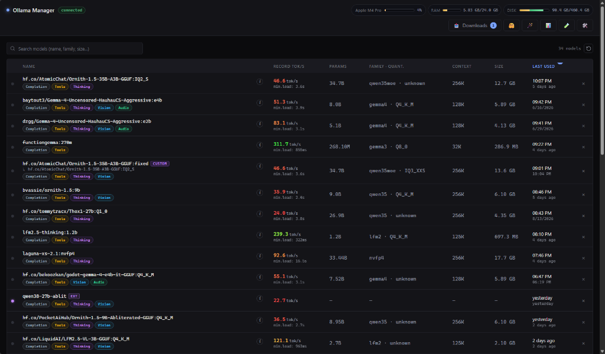

# ollama-manager

Tiny, fast, and feature-packed Go web server to manage and interact with [Ollama](https://ollama.com) models on your local machine or LAN.



## Features

- **Model Management**:
  - Comprehensive model catalog: name, family, parameter count, quantization, model size, context length, install date, and loaded status (VRAM/RAM).
  - **Instant Live Search & Filter**: quickly filter models in real-time with an adaptive desktop/mobile search bar and column sorting (persisted in `localStorage`).
  - **Full Model Inspector**: view modelfiles, Jinja/Go templates, license, parameters, and architecture details.
  - **Model Repair & Patch**: inspect, test, and automatically patch missing tool templates or invalid stop tokens for community models.
  - **Uninstall History & Archiving**: keep track of uninstalled models with optional deletion reason notes.

- **System Diagnostics**:
  - Live system meters in the top header: CPU load, RAM usage (including memory used by currently loaded models), and disk storage (used/free).

- **Rich Web Chat Interface**:
  - Real-time streaming via Server-Sent Events (SSE) with smooth live **tokens/second (tok/s)** and total execution time counters.
  - **Message Editing & Regeneration**: edit the last submitted message to resend and regenerate answers; easily cancel queued turns to recover original text and media assets into the input box.
  - **Subtle Finish Reason Indicators**: clearly marks completion states (*stop*, *length limit*, *stopped*, *tool limit*).
  - **Per-Model System Prompt & Config**: customizations (system prompt, temperature, top-k, top-p, thinking flags) automatically save per model in `localStorage`, with an underlined **Reset to defaults** button.
  - **Global Chat Defaults**: configure server-wide fallback chat parameters saved directly in `config.json`.
  - **Multimodal Support**: image generation, vision inputs, audio attachments, and browser microphone voice recording.
  - **Thinking Traces**: collapsible and chronologically structured `<think>` reasoning traces.

- **Web Tools & Live Artifacts Agent**:
  - **Internet Access (Web Tools)**: server-side bounded web agent utilizing DuckDuckGo (`web_search`) and direct HTTP (`web_fetch`) with a structured timeline (think → tool execution → answer).
  - **Artifacts Workspace**: interactive sandbox allowing the model to create and modify web apps/HTML/JS/Python files (`create_artifact`, `write_file`, `replace_in_file`, `exec`) with a live side-by-side draggable splitter and live preview.

- **Tests & Benchmark Suite**:
  - Built-in benchmark and evaluation runner to test models against standardized prompts and compare speed, context processing, and accuracy.

- **Persistent Download Queue**:
  - Enqueue multiple downloads with FIFO processing, real-time download progress streams, cancel/retry controls, and persistence across server restarts via `jobs.json`.

- **Security & Portability**:
  - Single binary, zero external dependencies, minimalist dark UI, and bilingual interface (English / Spanish).
  - Optional password authentication (bcrypt + HMAC-signed session cookies).
  - Configurable via `config.json` or through the in-app **⚙ Settings** modal.

---

## Requirements

- **Go 1.25 or later** (for building from source).
- **Ollama** running locally or remotely (defaults to `http://localhost:11434`).

---

## Build

```bash
# Standard build (embeds VCS metadata automatically)
go build -o ollama-manager .

# Embed compilation date/time manually
go build -ldflags "-X 'main.buildTime=$(date +'%F %T')'" -o ollama-manager .
```

### Cross-Compilation

```bash
GOOS=linux   GOARCH=amd64 go build -ldflags "-X 'main.buildTime=$(date +'%F %T')'" -o dist/ollama-manager-linux .
GOOS=darwin  GOARCH=arm64 go build -ldflags "-s -w -X 'main.buildTime=$(date +'%F %T')'" -o dist/ollama-manager-macos .
GOOS=windows GOARCH=amd64 go build -ldflags "-X 'main.buildTime=$(date +'%F %T')'" -o dist/ollama-manager.exe .
```

```powershell
# Windows PowerShell example
$env:CGO_ENABLED = "0"; $env:GOOS = "darwin"; $env:GOARCH = "arm64"; go build -trimpath -ldflags="-s -w -X 'main.buildTime=$((Get-Date).ToString('yyyy-MM-dd HH:mm:ss'))'" -o ollama-manager .
```

### Automated Multiplatform Release Scripts

- **Build all platforms**:
  ```powershell
  ./build-all.ps1 -Version v1.0.0
  ```
- **Release to GitHub**:
  ```powershell
  $env:GITHUB_TOKEN = "your_github_token"
  ./release.ps1 v1.0.0
  ```

---

## Usage

```bash
./ollama-manager                      # uses ./config.json
./ollama-manager -config /path/cfg.json
./ollama-manager set-password <pwd>   # hashes and stores password
./ollama-manager clear-password       # removes password
./ollama-manager version
```

On first launch, `config.json` is generated automatically:

```json
{
  "port": 7860,
  "expose_network": false,
  "password_hash": "",
  "session_secret": "<auto>",
  "ollama_url": "http://localhost:11434",
  "language": "en",
  "chat_defaults": {
    "system_prompt": "",
    "temperature": 0.7,
    "top_k": 40,
    "top_p": 0.9,
    "web_tools": false,
    "artifacts": false
  }
}
```

- `port`: HTTP port for the manager.
- `expose_network`: `false` binds only to `127.0.0.1`. Set to `true` to listen on `0.0.0.0` for LAN access.
- `password_hash`: bcrypt hash; empty means no authentication is required.
- `session_secret`: HMAC secret key used to sign session cookies.
- `ollama_url`: URL of the Ollama server.
- `language`: UI language (`en` or `es`).
- `chat_defaults`: global fallback chat parameters for models without custom overrides.

All settings can be modified live through the **⚙ Settings** modal in the UI.

### Exposing to LAN & Microphone Permissions

```bash
./ollama-manager set-password "myStrongPass"
./ollama-manager
```

> [!WARNING]
> When enabling `expose_network` on your local network, always set a password to prevent unauthorized access.

#### Audio Recording on Remote LAN Devices
When accessing over `http://` from another machine or phone, modern browsers restrict microphone access to secure origins. In Chromium browsers (Chrome, Edge, Brave):
1. Navigate to `chrome://flags/#unsafely-treat-insecure-origin-as-secure`.
2. Add your server address (e.g. `http://192.168.1.50:7860`).
3. Set to **Enabled** and restart the browser.

---

## HTTP Endpoints

| Method | Path | Description |
| :--- | :--- | :--- |
| `GET` | `/` | Main single-page web UI |
| `GET`/`POST` | `/login`, `/logout` | Password authentication |
| `GET` | `/api/status` | System metrics, disk usage, and Ollama connection status |
| `GET` | `/api/models` | List installed models with loaded status and context lengths |
| `GET` | `/api/running` | Models currently loaded in VRAM/RAM (`/api/ps`) |
| `GET` | `/api/models/{name}` | Detailed model info, modelfile, parameters, and template |
| `DELETE` | `/api/models/{name}` | Uninstall model (with optional deletion reason tracking) |
| `POST` | `/api/chat` | SSE chat stream (`chunk`, `tool`, `done`, `error`) supporting Web Tools & Artifacts |
| `GET` | `/api/artifacts/{timestamp}/{path}` | Serve sandboxed artifact files for live preview |
| `POST` | `/api/model-repair/preview` | Generate patched Modelfile preview (tools/templates/stops) |
| `POST` | `/api/model-repair/apply` | Apply repair and build fixed model |
| `GET` | `/api/tests` | List benchmark test cases and prompt suites |
| `POST` | `/api/tests/run` | Execute model benchmarks and record performance metrics |
| `POST` | `/api/pull` | Enqueue a model download (`{"name":"llama3:8b"}`) |
| `GET` | `/api/jobs` | List download queue jobs |
| `GET` | `/api/jobs/events` | SSE stream for real-time download queue updates |
| `POST` | `/api/jobs/{id}/cancel` | Cancel a queued or active download |
| `DELETE` | `/api/jobs/{id}` | Delete a finished/cancelled job from history |
| `POST` | `/api/jobs/clear` | Clear all terminal download jobs |
| `GET` | `/api/config` | Read current configuration |
| `PATCH` | `/api/config` | Update settings (port, language, expose, chat defaults) |
| `POST` | `/api/config/password` | Set or clear password protection |

---

## Project Structure

```
.
├── main.go                     # CLI entrypoint and server bootstrap
├── config.example.json         # Reference configuration template
├── jobs.json                   # Runtime download queue persistence (git-ignored)
├── internal/
│   ├── agent/                  # Artifact agent and sandboxed execution tools
│   ├── config/                 # Configuration file loading and persistence
│   ├── diskusage/              # Cross-platform disk space detection
│   ├── jobs/                   # FIFO download queue worker and SSE dispatcher
│   ├── ollama/                 # Ollama API client (chat, pull, tags, ps, create)
│   ├── runner/                 # Benchmark test execution engine
│   ├── server/                 # HTTP router, middleware, handlers, and SSE streams
│   ├── sysmetrics/             # Live CPU, RAM, and VRAM telemetry
│   └── tests/                  # Test suite storage, seeding, and management
└── web/                        # Embedded frontend UI (HTML, CSS, JS, I18n)
```

---

## Development

```bash
# Run tests
go test -v ./...

# Start in development mode
go run . -config dev.json
```

Frontend assets are bundled into the Go binary via `//go:embed all:web`.

---

## License

[MIT](LICENSE)
